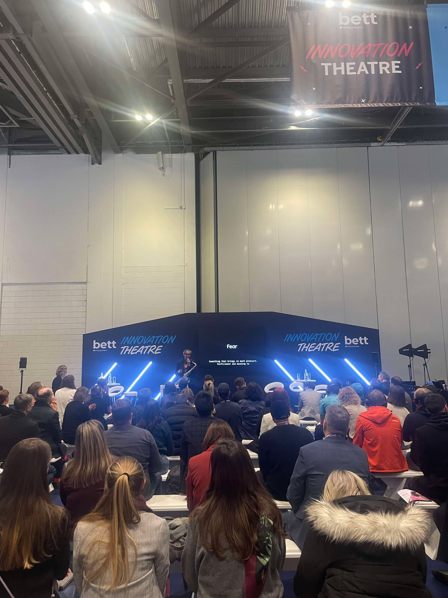
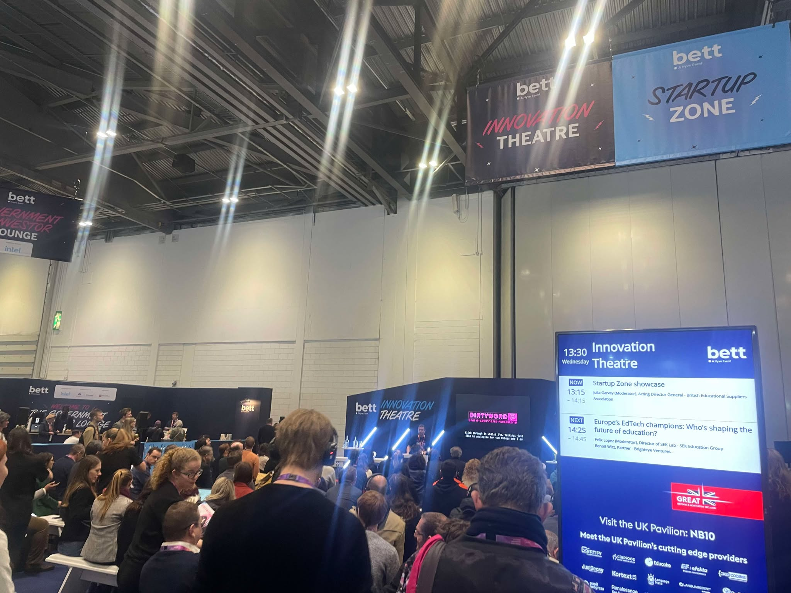
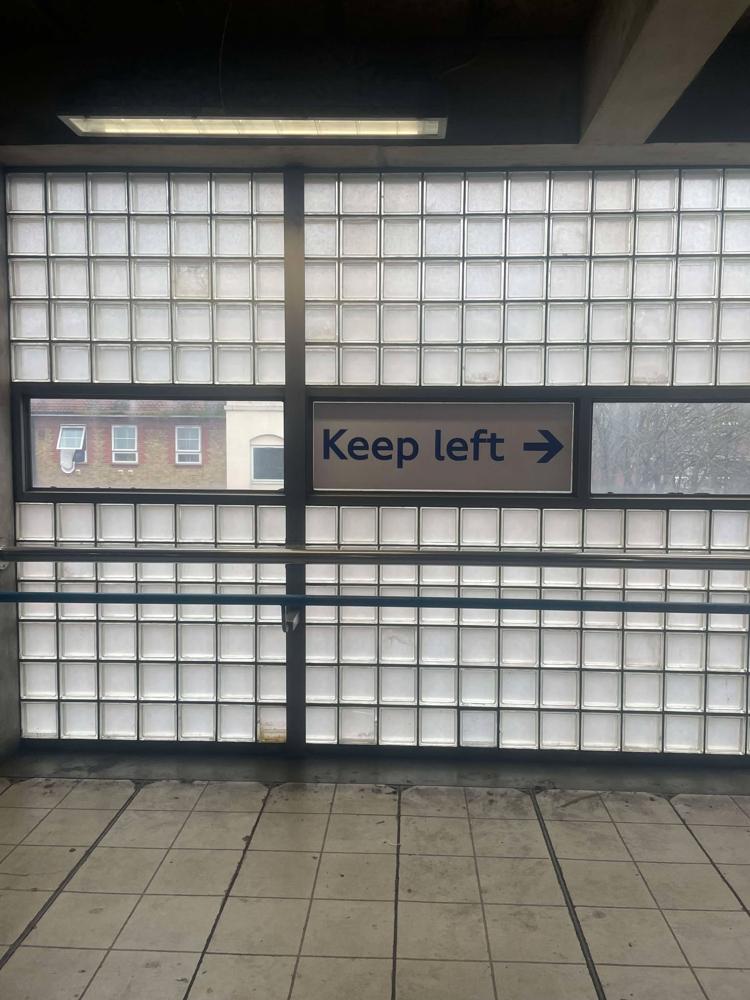

# Bett 2025 EdTech fair

> LT version and photos below

I've recently had a chance to participate in the biggest edtech fair **in the world** - Bett 2025 - in London. I didn't have a big plan or passion, just wanted to learn more about the edtech demand and opportunities abroad (since I have an edtech startup myself). But I still tried to gather as much experience as I could.

So here's my thoughts.

## Status quo

I own a company called Skafis ([skafis.lt](https://www.skafis.lt)) which makes edtech projects. For now not much money was generated, just a few hundred euros from donations on one website. But I have an idea, motivation and people who need the things I make.

I also just finished my minor studies on Pedagogy at Vilnius University, wrote my final thesis about edtech in math class (you can check it out [here](thesis.pdf)).

Hopefully later gonna build an LMS (learning management system). I started making one with a team, but didn't pay much of attention, so the project is suspended.

In general, education in Lithuania is not the best (on average) and teachers don't really like using tech. Or just don't have enough funds devoted for it. So as a _kind of_ math teacher and _kind of_ programmer I see a lot of potential in this field, and a great ability to actually contribute to Lithuania's education. Sadly, education sector for business is not very profitable (or at least with my mentality). And it's also really hard to get into the market (sorry, no source, just _I've heard that_).

## Bett. 23 and 24 Jan

I just got back from London, where I mainly attended startup presentations and the international TeachMeet (https://www.teachmeetglobal.org).

AI, of course, was heavily promoted by everyone, but there wasn’t anything particularly new - just the same generalized content creation and AI tutoring. The only standout presentation that wasn’t focused on promoting a specific product came from a Moldovian EdTech trainer. He summarized recommendations for using AI, emphasizing that it shouldn’t immediately replace teachers entirely but should instead serve as a supportive tool. It was surprising that others didn’t really talk about this, as it seems like a crucial point for AI implementation - a gradual transition rather than the "all-in-one, fully digitalized" approach many were advocating. Here are the slides: https://gamma.app/docs/Enhancing-Student-Engagement-via-Integrating-Generative-AI-Human--l5tok5a3643rz5a

There were some interesting insights from other teachers, but nothing particularly striking. I didn’t come across Finnish or Dutch stands - I got overwhelmed by the event’s size. However, a teacher from Finland spoke about how colors on walls (using a projector) and music can help with learning math, while a teacher from the Netherlands talked about teaching programming and how they encourage interactivity and engagement using Microbit.

Regarding startups, there wasn’t anything extraordinary - mostly the same testing/assessment and content creation systems. However, some did seem to be high-quality and promising, like a testing system that wasn’t overloaded with unnecessary details and didn’t rely on AI-generated content. There was also a presentation about an EdTech product for music education, but it didn’t leave much of an impression - I don’t even remember exactly what it was about. I spoke with the creator of the testing system (intuitivo.pt) and the founder of an automated CV-building system that tracks skill acquisition (potential.ly).

Beyond that, I had a few conversations with teachers - a history teacher from Germany, a teacher from Moldova, and a school principal from Croatia. From what I gathered, they use technology about as much as schools in Lithuania do.

Overall, I didn’t learn anything particularly groundbreaking, just a few minor takeaways. Of course, everyone was keen to promote their products, but it didn’t seem like they had deeper insights into potential challenges.

------------------ LT VERSION ----------------------

Grįžau iš Londono, pagrinde dalyvavau startup prezentacijose ir tarptautiniame teachmeet (https://www.teachmeetglobal.org).

AI, žinoma, visi labai reklamavo, tačiau nebuvo kažko labai naujo - tas pats labai generalizuotas turinio kūrimas bei AI tutor'inimas. Išsiskyrė tik viena, ne orientuota į konkrečio produkto reklamą prezentacija iš Moldovos EdTech trainer. Apibendrino AI naudojimo rekomendacijas, kaip tai neturėtų būti iškart visą darbą atstojantis mokytojas, o tik padedantis įrankis. Keista, kad kiti nelabai apie tai kalbėjo, nes atrodo tai esminis dalykas, kad tranzicija po truputį būtų, o ne kaip kiti sako, kad iškart all-in-one turės viską skaitmenizuota. Čia skaidrės: https://gamma.app/docs/Enhancing-Student-Engagement-via-Integrating-Generative-AI-Human--l5tok5a3643rz5a

Prezentacijose buvo įdomių pastebėjimų ir iš kitų mokytojų, bet labai dėmesio neatkreipė. Suomių ar olandų stendų neatradau, truputį užgožė renginio dydis... Bet kalbėjo mokytojas iš Suomijos apie tai, kaip spalvos ant sienų (su projektoriumi) ir muzika padeda pvz mokytis matematikos. Iš Olandijos mokytoja kalbėjo apie programavimo mokymą, kaip skatina interaktyvumą ir įspūdžių sukėlimą, naudoja microbit.

Iš startupų pusės, nebuvo kažko įpatingo, tos pačios testavimo ir turinio kūrimo sistemos. Bet buvo ir skambančių kokybiškai ir perspektyviai (pvz testavimo sistema, kuri neapkrauta smulkmenomis ir nesitelkia AI generavimu). Buvo ir muzikos edukacijai skirto produkto prostatymas, bet nepaliko įspūdžio, tiksliai net nepamenu apie ką buvo. Kalbėjau su testavimo sistemos (intuitivo.pt) kūrėju bei su tokios kaip supratau automatizuotos CV kūrimo sistemos, sekančios įgūdžių įgijimo kelią, (potential.ly) autoriumi.

Daugiau tik pakalbėjau su keliais mokytojais (istorijos iš Vokietijos, iš Moldovos bei Kroatijos mokyklos direktore). Bet kiek supratau, technologijas maždaug tiek pat, kiek Lietuvoje naudoja.

Tai bendrai labai kažko ypatingo nesužinojau, tik va tokių keletą smulkmenų. Visumoje, žinoma, norėjo visi reklamuotis, bet neatrodė, kad turėtų gilesnių įžvalgų apie galimus iššūkius.

## Photos

