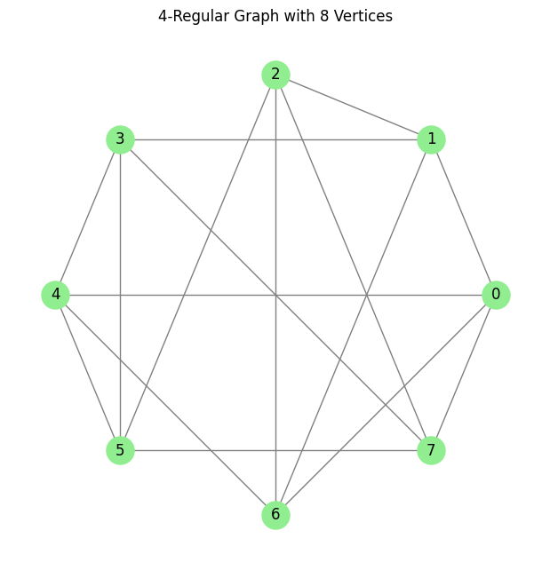
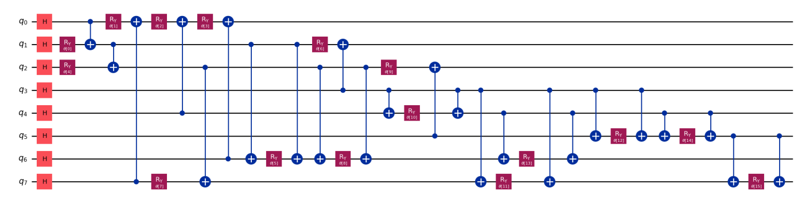
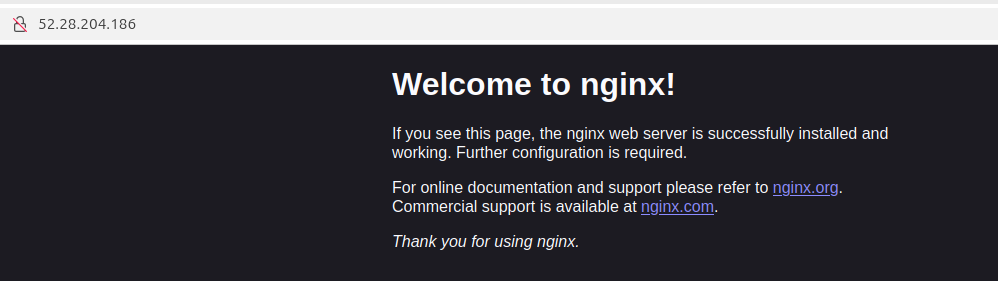
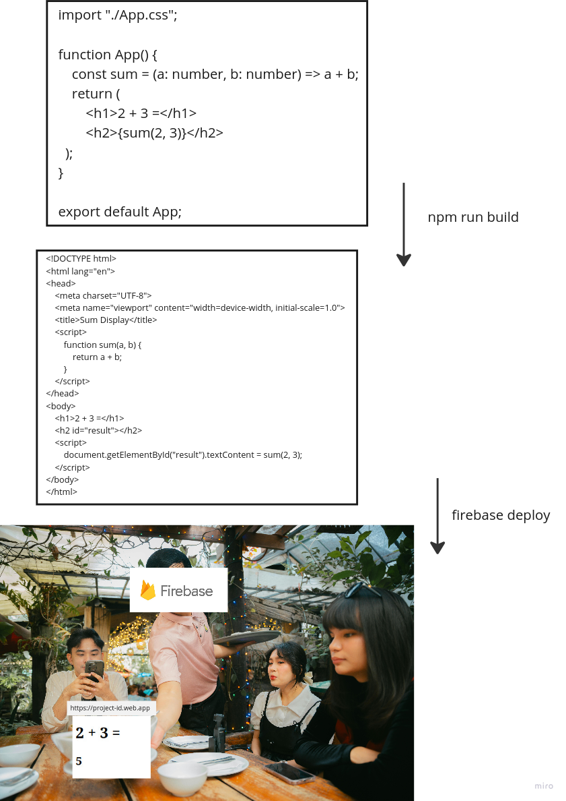
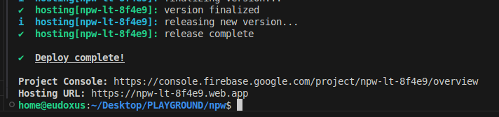
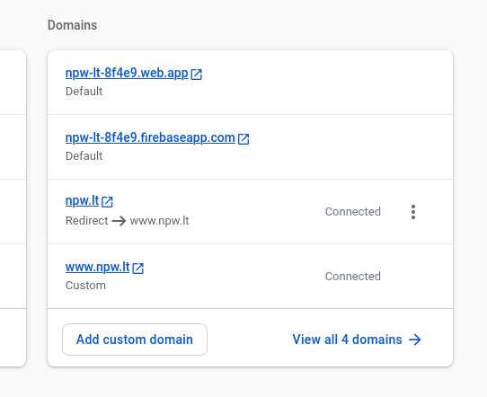
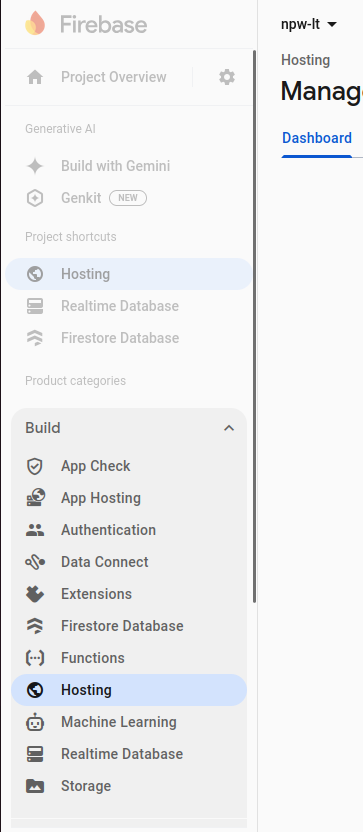

# Mokesčiai ir verslumas I dalis (Darbo sutartis, Individualios veiklos pažyma, MB kūrimas)

Pasakosiu, ką išsiaiškinu apie verslo kūrimą Lietuvoje. Dalinuosi, nes užknisa, kai labai mažai informacijos internete, nes visgi čia Lietuvos dalykas ir negali pažiūrėti indiškų _tutorialų_ per YouTube. Mano verslas yra susijęs su matematikos mokymu ir programavimu.

_Post'o_ datą matote, tačiau kviečiu parašyti, jei kur nusišnekėjau ar informacija jau paseno.

## Darbas su darbo sutartimi

Tai čia _for total beginners_, kaip veikia mokesčiai.

Gauni darbą. Pasirašai darbo sutartį. Darbdavys (įprastai) tau perveda pinigus kurie jau yra **tavo**, kitaip tariant, tavo pajamos ir paprastai nereikia mokėti jokių mokesčių. Pats darbdavys sumoka provalomą sveikatos draudimą (PSD) nuo tavo iš tikrųjų uždirbtų pinigų, galimai dar ir kitus mokesčius sumoka, bet čia jau nereikia gilintis (jei įdomu, turėtų darbadavys duoti kvitą su visais mokesčių apskaičiavimais).

Tai dėl PSD nereikia nerimauti. PSD duoda būtent nemokamą gydymą (kai nueini pas šeimos gydytoją ir gauni konsultaviją, o tada duoda siuntimą, jei reikia, pas kitą gydytoją dėl rimtesnių dalykų). Ir jei su darbo sutartimi dirbi, darbdavys moka PSD, jei studijuoji ar mokaisi, univeras moka PSD. Jei nei to nei to nedarai ir nedirbi su sutartimi - pats turi mokėti (turint verslą; nežinau kaip ten su pašalpom tiksliai).

Ir tuomet kai gauni pajamas, kiekvienų metų pradžioje (paprastai iki gegužės) reikia **deklaruoti** tas pajamas. Tam pakanka nueiti į VMI EDS sistemą ir ten patvirtinti, kad darbdavio pateikta informacija apie pajamas yra teisinga. Bei pridėti kitas pajams (tokias, kaip dovanos, _trade'inimas_ ir pnš. - čia to neaptarsiu). Gali tekti primokėti gyventojų pajamų mokestį (GPM), bet dažniausiai jis jau būna permokėtas darbdavio ir galima, iš tikrųjų, net **susigrąžinti** dalį tų pinigų.

Tai čia naudojamasi sistema. Kas vyksta už tos sistemos užsklandos - pateikiama GPM311 deklaracija. Tai teoriškai galima ir ranka užpildyti GPM311 formos PDF dokumentą ir nusiųsti paštu VMI :D

## Individualios veiklos pažyma (korepetitorius)

Pirmiausia, niekam nerūpi kažkokie studentėliai, kurie užsidirbinėja porą euriukų mokydami kelis mokyklinukus matematikos. Tai ramiai, VMI nepasibels į duris ir neįmes į kalėjimą, jei paimsit 10 eurų grynais (ar pavedimu) iš kokio mokinio mamos. Bet čia nesiruošiu šnekėti apie _tax evasion_. Teoriškai reikėtų deklaruoti kiekvieną gautą centą.

Taigi, pirmiausia reiktų atlikti _research_, kuris variantas įforminti gautus pinigus yra tau geriausias. Būna žmonės ima verslo liudijimą, ima individualios veiklos pažymą, steigia MB... Populiariausia, paprasčiausia ir pradedantiesiems mažiausiai mokesčių su individualios veiklos pažyma.

Tuomet reikia gauti pačią pažymą. Jei konkrečiau - gauti numeriuką (pažymos nr.) iš Mano VMI sistemos. Korepetitoriavimui - 855900 Kitas, niekur kitur nepriskirtas, švietimas.

Tuomet yra superinė iAPS VMI sistema, kurioje galima išrašinėti sąskaitas faktūras, ir apskaita automatiškai bus pateikta VMI. T.y. pavasarį (deklaruojant pajamas) nereikės skaičiuoti, kiek buvo uždirbta, o tik reikės taip pat paspausti patvirtinimo mygtuką.

Čia pildoma sąskaita faktūra. Duodamas bet koks serijos kodas (_default_ ISAF) ir unikalus numeris (iš eilės paprastai rašoma). Nurodoma prekė/paslauga, jos kiekis ir kaina, galiausiai pateikiama apmokėjimo data. Tai šitie būtini duomenys. Galima, aišku, parašyti daugiau (pvz.: pirkėjui, šiuo atveju mokiniui, pateikti informaciją, už kokių dienų pamokas prašoma apmokėti, į kokią sąskaitą pervestin pinigus).

Pavasarį pildant pajamų deklaraciją reikės ir sumokėti mokęsčius už tas suvestas sąskaitas faktūras į iAPS VMI sistemą. Apie tai jau daug visur prirašyta. Maža apimtimi užsidirbant reikia mokėti 5% mokesčių.

## Mažosios bendrijos kūrimas

Pirmais metais nereikia mokėti jokių papildomų mokesčių\*! Ir taip pat galim padaryti klaidų ir nebūti labai nubaustam ir gauti tuomet konsultacijų! Ir šiaip, kadangi tai juridinis asmuo, tai labai blogoje situacijoje, jei kas paduos į teismą, neprarasi savo visų asmeninių santaupų, o tiesiog įmonė bankrutuos ir praras savo kapitalą.

\*Aišku, dėl mokesčių tai darau prielaidą, kad turi iš kitur PSD mokamą. Ir kaip įmonė gauna pajamas, tai jei nori kad tie pinigai būtų **tavo**, tai vis tiek reikės pervesti pinigus iš įmonės sąskaitos į savo asmeninę, ir tai skaitysis kaip asmeninės pajamos, tai vėlgi reikės mokėti GPM pavasarį už tai...

Pirmiausia, vėlgi, reiktų _pasiresearchint_ ir apsispręsti ar MB tikrai geriausias situacijos sprendimas. Nes po pirmų metų mokesčių visumoje skaičiuosis daugiau nei su individualios veiklos pažyma.

O dabar apie įkūrimą:

1. Įsigykit LT ID iš Registrų centro (į padalinį nueit reiks). Taip galima bus **nemokamai** prisijungti prie Registrų Centro savitarnos. Galima, aišku, mokėti už el. parašą ten iki euro iš telefono operatoriaus (pvz.: Telia, Tele2 ir t.t.).

2. Tuomet rekomenduoju įsigyti buveinės adresą (galima rasti už 25 eurus neribotam laikui). Galima, aišku, rašyti ir bet kokį kitą adresą, kad ir savo gyvenamąjį, bet turėk omeny, kad šis adresas bus viešai visiem matomas.

3. Dėl viešumo taip pat rekomenduoju įsigyti naują telefoną, nes reikės telefono numerį taip pat viešai paskelbti. Taip pat reikia el. pašto, kuris irgi viešas bus.

4. Prisijungus prie Registrų Centro savitarnos su LT ID galima įsteigti MB. Steigiant nelabai yra skirtumas, ar bus tik vienas narys/vadovas, ar bus daugiau. Steigimas nelabai skiriasi. Nėra minimumo pradiniam įnašui, tai gali būti nors ir 1 euras. Bet, žinokit, nežinau ar po to nebus problemų didinant kapitalą iš savo lėšų (bandau dabar tai daryti). Visom tom dienom, per kiek laiko turi kažkas būti padaryta, sakyčiau rašykit arba 5 dienas, arba 30. Na, tai čia jau atitinkamai logiškai atsirink. Jei vienas esi tame MB, tai nu gi gal patvirtinsi savo paties prašymą :D Tai čia labiau jei kiti žmonės yra dar MB, arba žada būti. Taip pat, viską galima ateityje keisti - tačiau kainuos papildomai (apie 15 eurų).

5. Pateikiamas prašymas registrų centrui. Čia reikės sumokėti 17,13 euro.

6. Tuomet gan greitai turėtų būti patvirtinta. Ir tuomet turėtų atkeliauti laiškas iš Valstybės duomenų agentūros (ar bent jau man atkeliavo) dėl įmonės **pagrindinės veiklos kodo arba žodžiais aprašomos įmonės veiklos** ir **įmonės įstatinio kapitalo sudėties procentais** (na, tai čia jei vienas esi, tai ir bus 100 %). Numeriukas veiklos pas mane pvz. yra "Kompiuterių programavimo veikla nr. 62.01", tai taip ir atrašiau į tą el. laišką.

7. Tuomet galima kurti banko sąskaitą. Kadangi jau buvau Swedbanke, tai ten ir verslo sąskaitą atsidariau. Ten iš eilės išvardinta buvo, kokios reikia informacijos. Buvo tik problema vėl su veiklos kodais - pateikiau maždaug tą patį kaip pateikiau kuriant MB ir atsakant į tą duomenų agentūros laišką, bet čia nepatiko Swedbankui, nes, pasirodo, reikia (1) pateikti MB narių sąrašą JADIS RC sistemoje bei nurodyti naudos gavėjus JANGIS sistemoje. Nu ir tada jau patvirtino viską. Tai, žodžiu, po įkūrimo tiesiog atsakinėkit į laiškus :D

## Pabaigai apie MB

Įkūrus MB turbūt kyla daug klausimų apie pinigus - kaip kur juos įforminti, kur kam paskelbti, ko nepraleisti, kaip netyčia nepadaryti _tax evasion_. Ir kaip nepermokėti per daug mokesčių.

Tai pradžiai, kai nežinot ką daryti, tiesiog rašykitės visus šia tema išleistus ir gautus pinigus į _Excel sheet_. Vienintelis dalykas, dėl kurio reiktų nerimauti, tai pavasarį iki kovo 31 dienos reikalingi pateikti apskaitos dokumentai (pajamos ir išlaidos). Tai jei turėsit visą informaciją apie pinigus su savimi, blogiausiu atveju galėsite tiesiog pavasarį pasisamdyti buhalterį, kuris viską sutvarkys ir įformins.

Plačiau apie MB buhalteriją kitame _poste_.

## Apibendrintai

Pajamų deklaracija - EDS.

Individualios pažymos gavimas - ManoVMI.

MB įkūrimas - Registrų centras (su nemokama LT ID).

Mokęsčiai:

1. PSD sumoka arba universitetas, arba darbdavys (su darbo sutartimi), rūpintis reikia tik neturint nė vieno.
2. GPM. Tavo pajamas nurodo VMI:
   - su darbo sutartimi - darbdavys (ir sumoka GPM, susigražini permokėtą dalį deklaruojant),
   - su individualios veiklos pažyma - iAPS sistema, pačiam suvedus per ją sąskaitas faktūras (deklaruojant sumoki GPM),
   - dirbant MB (pvz. kaip vadovui) - MB juridinis asmuo iki kovo 31 dienos per Registrų centrą (deklaruojant kaip fizinis asmuo sumoki GPM).

Čiau.
