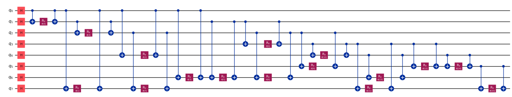
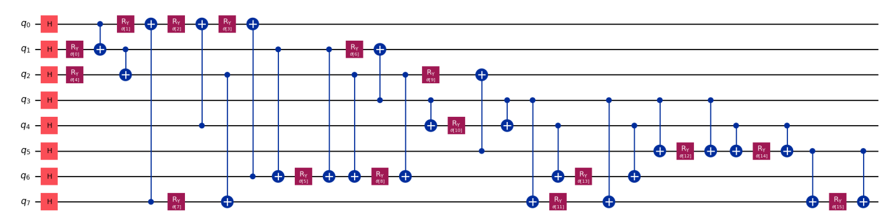

# QuHack 2025 hackaton

Since I am writing my bachelor thesis on quantum computing, and my friend recommended, I participated in QuHack 2025 hackaton (organized by MIT), remotely.

Quantum computing hackaton is not like a regular hackaton - extensive keyboard scrabbling, drawing graphs, brainstorming ideas, making some real world used product... I think it's obvious why - there is not much made in quantum computing field at all. So it was more like an olympiad - solving some given problems, finding the best, most optimal solution.

## Program

Everything was streamed online from MIT, for the remote participants. Before the beginning of hackaton, there was a lot of material given to prepare, to learn the basics of quantum computing. There was an [opening ceremony](https://www.youtube.com/watch?v=IhNB7KHQGXc), scientists from physics, mathematics and computer science fields introduced the idea of quantum computing, discussed the current situation in the world and gave some opinions on popular topics (such as interpretation of quantum mechanics). The basic idea was - just go to a lab and see how lasers interact yourself. Or just don't understands, because you are not "built" for this. And just do the math.

And yes, quantum computing is in relatively early state of development (theory is discovered before it is possible to check it practically). And has many applications.

After the opening ceremony there were the workshops,

## Challanges

There were 19 sponsors (mainly IONQ, Quantum rings, Classiq, DoraHacks). Challanges were given by them, the main ones. Our team (made from random not very experienced global students) chosen the challanges given by IONQ.

We were given [max-cut problem](https://en.wikipedia.org/wiki/Maximum_cut) basic solution. Max-cut problem looks for "slicing" thourgh the edges in the given graph, so that it goes through the biggest number of edges, separating graph into two. The given solution was a VQA (variational quantum algorithm) with a basic ansatz: qubits for nodes, all qubits superposed with $H$ gates, for each edge corresponding qubits were connected with $CNOT$ $R_y(\theta)$ $CNOT$. But for the optimisation part there was something unusual. It wasn't a classical optimisation algorithm that was used to update the parameters in circuit. It was also a quantum algorithm. There was given a basic hamiltonian, for which the ground state energy was being found using varQITE (variational quantum imaginary time evolution) algorithm ([varQITE paper](https://arxiv.org/pdf/2404.16135)). There were also a bunch of graphs given, to test the algorithm. Everything was in qiskit, there were a lot of concise and clear explanations on the problem. We had to modify the ansatz generation and the hamiltonian generation functions to solve these challanges:

1. Find a better ansatz, using less gates, maintaining accuracy (high quality), converging faster.
2. Change the ansatz and hamiltonian so that after the max-cut obtained subgraphs are ballanced (have the same amount of verteces).
3. Change the ansatz and hamiltonian so that after the max-cut obtained subgraphs would have to be connected (in each, all verteces would have edges to them).

What our team achieved? Sadly, nothing. But we did understand the problem (which alone was something) and we did have some ideas and tried to implement them. But after testing them on all the given graphs we realized, that those "improvements" to the ansatz doesnt work...

Heres my attempt to optimize the given ansatz. I noticed that $CNOT$ on $|++\rangle$ state doesnt change it:

$$
\ket{++} = \frac{1}{2}(\ket{00} + \ket{01} + \ket{10} + \ket{11}) \longrightarrow^{CNOT} \frac{1}{2}(\ket{00} + \ket{01} + \ket{11} + \ket{10})
$$

So I figured - why not rearrange the circuit so that it is still performing the same functionality, but has all $CNOT$ s thrown to the beginning, which would cancel them? And I can also "flip" the $CNOT$ s, since the given graphs are undirected.

So as an example, this was one of the graphs:


And this was the given basic ansatz:



This was my obtained ansatz after some modification:



Doing this:

```python
def build_ansatz(graph: nx.Graph) -> QuantumCircuit:

    ansatz = QuantumCircuit(graph.number_of_nodes())
    ansatz.h(range(graph.number_of_nodes()))

    used_nodes = set()

    theta = ParameterVector(r"$\theta$", graph.number_of_edges())
    for t, (u, v) in zip(theta, graph.edges):
        if u not in used_nodes:
            ansatz.ry(t, v)
            ansatz.cx(u, v)
            used_nodes.add(u)
        elif v not in used_nodes:
            ansatz.ry(t, u)
            ansatz.cx(v, u)
            used_nodes.add(v)
        else:
            ansatz.cx(u, v)
            ansatz.ry(t, v)
            ansatz.cx(u, v)
            # used_nodes should already have both u and v
    return ansatz
```

So as you can see, there is significantly lower number of gates, and more importantly - less $CNOT$ s. And on paper the circuit should be equivalent to the old one. But, sadly, **THIS DIDN'T WORK**. It didn't even converge... So this was just an idea and we, with the team, couldn't figure out what was the problem. But if you know, please let me know! (in the comments below, or write an email).

## Overall

Overall, problems were hard. And I (together with my team members) were not prepared well for that. However, our aim was to learn more about quantum computing, not to win. And I think we achieved that aim. Me, personally, I've gto a better understanding of the quantum computing field, got more interested into it and even decided (not the final decision) to pursue my career (both academic and corporate) in this field.
