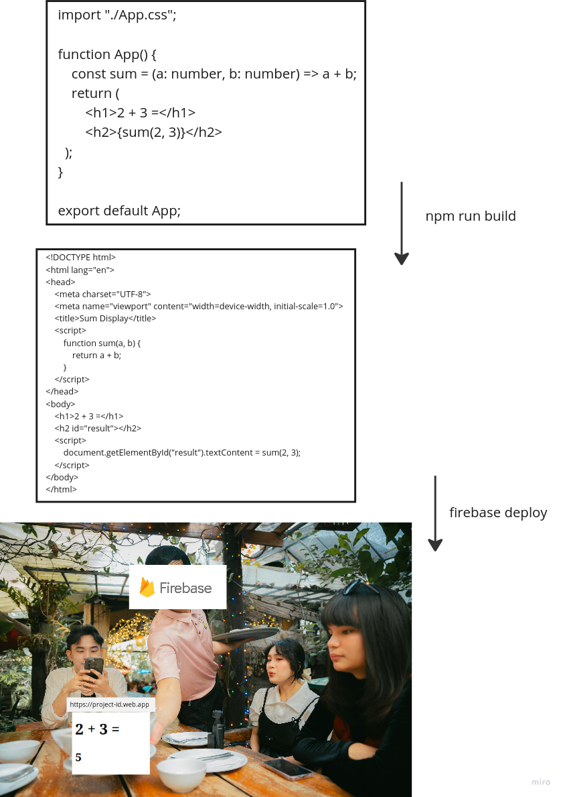
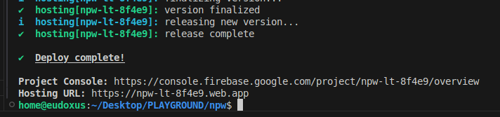
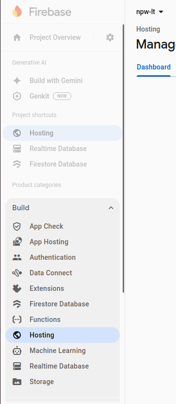
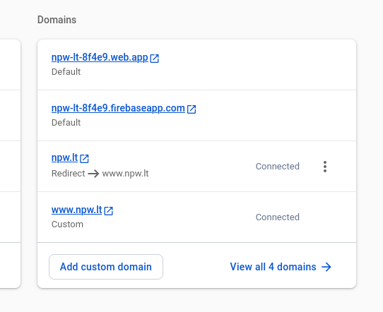

# Deployment: linux server, nginx, SSL, docker, react

This post explains how to deploy basic react website using:

- AWS EC2 ubuntu server
- nginx
- docker
- certbot (let's encrypt)
- react

Later gonna have some YouTube videos (possibly).

## Intro

Ok. So you learned to make html files. So called "websites". But, sadly, your grandma can't open `C:/Users/Carl/Descktop/website.html` from her computer. So how do you make your website "public"?

Of course, you can use Wordpress, Wix or some other platform that's gonna make your matters easier, if you just want to have a website. But this post is not about that. We want to have **full** control on our website and understand how things actually work under the hood.

## For total beginners

What is the Internet? That's nothing more than just a bunch of computers connected together with some wires. Those wires send electricity impluses in a certain pattern and this way send data. And then there is an international standard consensus on what that data would mean. So some computer can get a message "hey, give me what you got on port 80" and then decide to give back an html file. So if you make your website public - this just means that you make a certain computer with html file accessible to the whole world.

We use term "deploy", which basically means "making accessible on the Internet".

Also, obviously, we're gonna use CLI/shell/console (command prompt on windows, terminal on linux, idk what on macOS). So all the commands gonna be run on that. Commands are in `tool command` format in the posts, so just paste it to shell.

## Overview

Tutorial will have 3 parts:

1. Basic react website deploy with firebase
2. Basic html file deploy on linux server
3. Joining all together - react website deployed on linux server

## Part 1. Basic react website deploy with firebase

In this part, our aim is to have a hello world website set up like a normal website and ready to be coded. Optional part (but highly recommended) - setting up git.

### 1. Prerequisites

install nodejs with npm, have Google account, install git and have GitHub account (optional).

### 2. Create a React project and run it locally

(Optional) Create a repository on GitHub. Clone it using `git clone https://github.com/you-username/project-name` (you gonna need to generate a classic PAT to use as a password for GitHub locally).

`npm create vite@latest project-name --template react-ts`

(Optional) Move all the created files in project-name folder to the cloned GitHub repository folder.

Navigate to the folder (`cd project-name`).

`npm run dev`

Open `http://localhost:5173` on your browser. You can edit `src/App.tsx` file to change how the website looks.

`npm install firebase-tools`

`npm run build`, `firebase login`, `firebase init` (for this choose firebase hosting, /dist for public folder, don't replace index.html and you can optionally setup github actions, then it will do all this stuff automatically, when pushed to GitHub), `firebase deploy`.

That is it, you have your website. Console will look sth like this:

If that's the case, congrats, you have your website with the provided Hosting URL.

(Optional) `git add .` and `git commit -m "Initial commit"` and `git push origin main`.

Now you can make that URL more beautiful, but, of course, for that you will need to pay (amount depending on the charmingness of the URL). You can buy a domain on any DNS provider (I use Hostinger). Then go to console.firebase.google.com to your project, to the hosting hashboard and add your custom domain and then follow the given instructions (change DNS records on your DNS provider, where you bought a domain).

Done. Now you can change the code (`/src/App.tsx` file and add others) and then run `npm run build` and `firebase deploy` to update the website (or if you have set up GitHub Actions, then it's probably enough to push to GitHub repo and it will automatically update the deployment).

## Part 2. Basic html file deploy on linux server

... ot be continued

### Server options

It can be:

1. University server/user. For example, MIF in Vilnius University gives all students a login to the university network. But it has limitations...
2. Linode. You can get pretty cheap (5 dollars a month, but billed hourly) experimental linux servers there. And it can be set up pretty easily.
3. Google Cloud. Idk for sure, never used. Only for firebase, which is free, but you cannot host backend.
4. AWS. This is the most popular solution. It has **a lot** of deployment solutions, some are free, some are cheap, some are expensive. But it's also very overcomplicated, you need to actually learn to use it. And if you are not careful, you can get a very unexpected bill at the end of the month...
5. You can just use your own computer. For that, of course, you gonna need to have an internet plan from a provider. And have a router. Then you could read the small print on that router and login to the admin account to do the port forwarding. On that later, maybe.

We're gonna use AWS EC2.

### AWS

...

## Nginx

On server run command `sudo apt install nginx` and then `sudo systemctl start nginx`, check the running status with `sudo systemctl status nginx` and stop service with, you guessed it, `sudo systemctl stop nginx`.

That's it. Type your server ip address to the browser and you should see "Welcom to nginx" message. Like this:

That's it. Here you go, you have a website.

But you'd probably would want to:

1. edit the content of this website,
2. have the little lock next to ip without red line (make https instead of http),
3. have a name for website (domain).

## Edit content

`/var/www/html/index.nginx-debian.html` - edit this file content (you can do so with `nano` tool).

`/etc/nginx` - here you can find other content for configuring nginx.

## Setup SSL and domain

This will make requests/responses encrypted and safe. Basic option - using letsencrypt with certbot. But this is only needed for your own website doing everything from zero (later tutorial).

For now we can just use CloudFlare. It automatically provides SSL, when using a domain.
