# Editor guide

Md-math-field is made with [carta-md](https://beartocode.github.io/carta/introduction) and [mathlive](https://cortexjs.io/mathlive/) (so if you want, you can go straight to the source docs). It supports:

- markdown
- katex math
- tikzjax with these tikz packages:
	- chemfig
	- tikz-cd
	- circuitikz
	- pgfplots
	- array
	- amsmath
	    - amstext
	- amsfonts
	- amssymb
	- tikz-3dplot

# Latex examples

<details>
<summary>

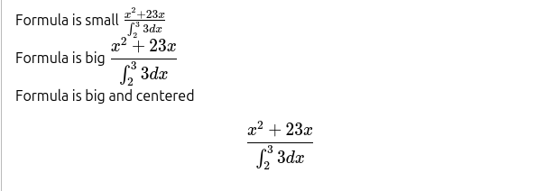

</summary>

````latex
Formula is small $\frac{x^2+23x}{\int_2^3 3 dx}$\
Formula is big $\displaystyle \frac{x^2+23x}{\int_2^3 3 dx}$\
Formula is big and centered
$$
\frac{x^2+23x}{\int_2^3 3 dx}
$$
````

</details>

<details>
<summary>

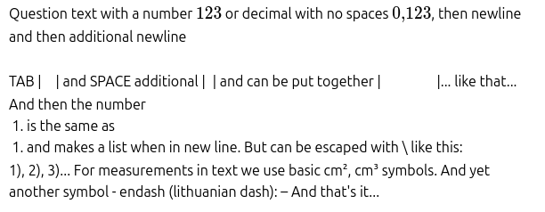

</summary>

````latex
Question text with a number $123$ or decimal with no spaces $0{,}123$, then newline

and then additional newline

\
TAB |&emsp;| and SPACE additional |&ensp;| and can be put together | &emsp; &emsp; &emsp; |... like that...

And then the number 
1. is the same as 
1) and makes a list when in new line. But can be escaped with \ like this:

1\), 2\), 3\)... For measurements in text we use basic cm², cm³ symbols. And yet another symbol - endash (lithuanian dash): – And that's it...
````

</details>

<details>
<summary>


</summary>

```latex

Closed question with choices...

**A** Choice $1$ &emsp;
**B** Choice $2$ &emsp;
**C** Choice $3$ &emsp;
**D** Choice $4$

```

</details>

# Useful tikz examples (math templates)

<details>
<summary>

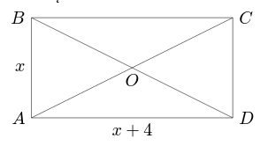

</summary>

````latex
```tikz
\begin{document}
\begin{tikzpicture}[scale=1.5]

	\coordinate (A) at (-2,-1);
	\coordinate (B) at (-2,1);
	\coordinate (C) at (2,1);
	\coordinate (D) at (2,-1);
	
	\draw (A) -- (B) -- (C) -- (D) -- (A) -- (C);
	\draw (B) -- (D);
	
	\node[left, scale=1.5] at (A) {$A$};
	\node[left, scale=1.5] at (B) {$B$};
	\node[right, scale=1.5] at (C) {$C$};
	\node[right, scale=1.5] at (D) {$D$};
	\node[below, scale=1.5] at (0,0) {$O$};
	\node[below, scale=1.5] at (0,-1) {$x+4$};
	\node[left, scale=1.5] at (-2,0) {$x$};
	

\end{tikzpicture}
\end{document}
```
````

</details>

<details>
<summary>

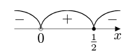

</summary>

````latex
```tikz
\begin{document}
\begin{tikzpicture}

% Axis
\draw (-2,0) -- (2,0);
\fill (2,0) -- (1.8,0.1) -- (1.8,-0.1) -- cycle;
\node[below, scale=1.5] at (1.9,0) {$x$};

\coordinate (-B) at (-1.8,0);
\coordinate (B) at (-1,0);
\coordinate (BC) at (0,0);
\coordinate (C) at (1,0);
\coordinate (C+) at (1.7, 0);

\draw (B) circle (2pt);
\node[below, scale=1.5] at (B) {$0$};

\fill (C) circle (2pt);
\node[below, scale=1.5] at (C) {$\frac12$};

\node[above, scale=1.5] at (-B) {$-$};
\node[above, scale=1.5] at (BC) {$+$};
\node[above, scale=1.5] at (C+) {$-$};

\draw[thick] (B) arc[start angle=180, end angle=0, x radius=1, y radius=0.7];
\draw[thick] (C) arc[start angle=180, end angle=90, x radius=1, y radius=0.7];
\draw[thick] (B) arc[start angle=-360, end angle=-270, x radius=1, y radius=0.7];

\end{tikzpicture}
\end{document}
```
````
</details>

<details>
<summary>

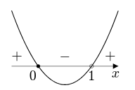

</summary>

````latex
```tikz
\begin{document}
\begin{tikzpicture}

% Axis
\draw (-2,0) -- (2,0);
\fill (2,0) -- (1.8,0.1) -- (1.8,-0.1) -- cycle;
\node[below, scale=1.5] at (1.9,0) {$x$};

\coordinate (-B) at (-1.8,0);
\coordinate (B) at (-1,0);
\coordinate (BC) at (0,0);
\coordinate (C) at (1,0);
\coordinate (C+) at (1.7, 0);

\fill (B) circle (2pt);
\node[below, scale=1.5] at (-1.2,0) {$0$};

\draw (C) circle (2pt);
\node[below, scale=1.5] at (C) {$1$};

\node[above, scale=1.5] at (-B) {$+$};
\node[above, scale=1.5] at (BC) {$-$};
\node[above, scale=1.5] at (C+) {$+$};

\draw[thick, domain=-2:2, samples=100] plot (\x, {0.7*(\x+1)*(\x-1)});


\end{tikzpicture}
\end{document}
```
````
</details>

<details>
<summary>

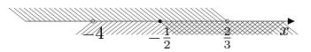

</summary>

````latex
```tikz
\begin{document}
\begin{tikzpicture}

% Axis
\draw (-6,0) -- (2,0);
\fill (2,0) -- (1.8,0.1) -- (1.8,-0.1) -- cycle;
\node[below, scale=1.5] at (1.7,0) {$x$};

% Interval start point
\coordinate (-B) at (-6,0);
\coordinate (B) at (-4,0);
\coordinate (C) at (-2,0);
\coordinate (D) at (0,0);
\coordinate (D+) at (1.7, 0);

\draw (B) circle (1.5pt);
\node[below, scale=1.5] at (B) {$-4$};

\fill (C) circle (1.5pt);
\node[below, scale=1.5] at (C) {$-\frac12$};

\draw (D) circle (1.5pt);
\node[below, scale=1.5] at (D) {$\frac23$};

\foreach \x in {-6,-5.85,...,0} { 
	\draw (\x,0) -- (\x-0.5,0.4);
}

\foreach \x in {-4, -3.85,...,1.7} { 
	\draw (\x,0) -- (\x-0.5,-0.4);
}

\foreach \x in {-2, -1.85,...,1.7} { 
	\draw (\x,0) -- (\x+0.5,-0.4);
}

\end{tikzpicture}
\end{document}
```
````
</details>

<details>
<summary>

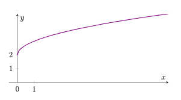

</summary>

````latex
```tikz
\usepackage{pgfplots}

\begin{document}

\begin{tikzpicture}
    \begin{axis}[
        axis lines=middle,
        xlabel={$x$},
        ylabel={$y$},
        samples=100,
        domain=0:9,
        ymin=0, ymax=5,
        xmin=-0.5, xmax=9,
        xtick={0,1},
        ytick={0,1,2},
		extra x ticks={0},
		extra x tick labels={$0$},
		extra x tick style={tick label style={font=\small}},
        tick label style={font=\small},
    	scale only axis,
	    width=7cm,
    	height=3cm
    ]
        \addplot[thick, violet] {sqrt(x) + 2};
    \end{axis}
\end{tikzpicture}

\end{document}
```
````
</details>

<details>
<summary>

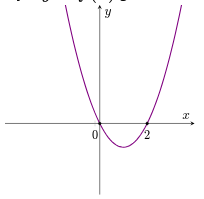

</summary>

````latex
```tikz
\usepackage{pgfplots}

\begin{document}

\begin{tikzpicture}
    \begin{axis}[
        axis lines=middle,
        xlabel={$x$},
        ylabel={$y$},
        samples=100,
        domain=-4:4,
        ymin=-3, ymax=5,
        xmin=-4, xmax=4,
        xtick={0,2},
		ytick={0},
		extra x ticks={-0.2},
		extra x tick labels={$0$},
		extra x tick style={tick label style={font=\small}},
        tick label style={font=\small},
    	scale only axis,
	    width=5cm,
    	height=5cm
    ]
        \addplot[thick, violet] {x^2-2*x};
		\addplot[only marks, mark=*, mark size=1pt, black] coordinates {(2,0)};
		\addplot[only marks, mark=*, mark size=1pt, black] coordinates {(0,0)};

    \end{axis}
\end{tikzpicture}

\end{document}
```
````
</details>

<details>
<summary>

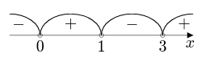

</summary>

````latex
```tikz
\begin{document}
\begin{tikzpicture}

% Axis
\draw (-4,0) -- (2,0);
\fill (2,0) -- (1.8,0.1) -- (1.8,-0.1) -- cycle;
\node[below, scale=1.5] at (1.9,0) {$x$};

\coordinate (-A) at (-3.7,0);
\coordinate (A) at (-3,0);
\coordinate (AB) at (-2,0);
\coordinate (B) at (-1,0);
\coordinate (BC) at (0,0);
\coordinate (C) at (1,0);
\coordinate (C+) at (1.7, 0);

\draw (A) circle (2pt);
\node[below, scale=1.5] at (A) {$0$};

\draw (B) circle (2pt);
\node[below, scale=1.5] at (B) {$1$};

\draw (C) circle (2pt);
\node[below, scale=1.5] at (C) {$3$};

\node[above, scale=1.5] at (-A) {$-$};
\node[above, scale=1.5] at (AB) {$+$};
\node[above, scale=1.5] at (BC) {$-$};
\node[above, scale=1.5] at (C+) {$+$};

\draw[thick] (A) arc[start angle=180, end angle=0, x radius=1, y radius=0.7];
\draw[thick] (B) arc[start angle=180, end angle=0, x radius=1, y radius=0.7];
\draw[thick] (C) arc[start angle=180, end angle=90, x radius=1, y radius=0.7];
\draw[thick] (A) arc[start angle=-360, end angle=-270, x radius=1, y radius=0.7];

\end{tikzpicture}
\end{document}
```
````
</details>

<details>
<summary>

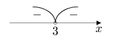

</summary>

````latex
```tikz
\begin{document}
\begin{tikzpicture}

% Axis
\draw (-2,0) -- (2,0);
\fill (2,0) -- (1.8,0.1) -- (1.8,-0.1) -- cycle;
\node[below, scale=1.5] at (1.9,0) {$x$};

\coordinate (-B) at (-0.8,0);
\coordinate (B) at (0,0);
\coordinate (BC) at (0.8,0);

\draw (B) circle (2pt);
\node[below, scale=1.5] at (B) {$3$};

\node[above, scale=1.5] at (-B) {$-$};
\node[above, scale=1.5] at (BC) {$-$};

\draw[thick] (B) arc[start angle=180, end angle=90, x radius=1, y radius=0.7];
\draw[thick] (B) arc[start angle=-360, end angle=-270, x radius=1, y radius=0.7];

\end{tikzpicture}
\end{document}
```
````

</details>

# More tikz examples

<details>
<summary>

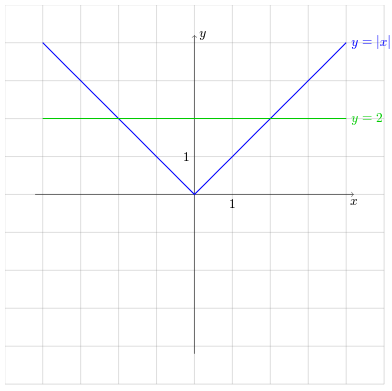

</summary>

````latex
```tikz
\begin{document}
  \begin{tikzpicture}

  % Draw grid
  \draw[step=1cm,very thin,color=black!50] (-5,-5) grid (5,5);

  % Draw axes
  \draw[->] (-4.2,0) -- (4.2,0) node[below] {$x$};
  \draw[->] (0,-4.2) -- (0,4.2) node[right] {$y$};

  % Draw absolute value function
  \draw[thick,blue,domain=-4:4] plot (\x,{abs(\x)}) node[right] {$y = |x|$};

  % Draw horizontal line y=2
  \draw[thick,green!80!black] (-4,2) -- (4,2) node[right] {$y = 2$};

  % Labels for specific points
  \node[below] at (1,0) {1};
  \node[left] at (0,1) {1};

  \end{tikzpicture}
\end{document}
```
````

</details>

<details>
<summary>

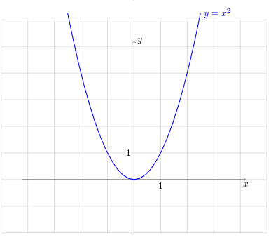

</summary>

````latex
```tikz

\begin{document}
\begin{tikzpicture}

    % Draw grid
    \draw[step=1cm,very thin,color=black!50] (-5,-2) grid (5,6);

    % Draw axes
    \draw[->] (-4.2,0) -- (4.2,0) node[below] {$x$};
    \draw[->] (0,-2.1) -- (0,5.2) node[right] {$y$};

    % Draw absolute value function
    \draw[thick,blue,domain=-2.5:2.5] plot (\x,{pow(\x, 2)}) node[right] {$y = x^2$};

    % Labels for specific points
    \node[below] at (1,0) {1};
    \node[left] at (0,1) {1};

\end{tikzpicture}
\end{document}

```
````

</details>

<details>
<summary>

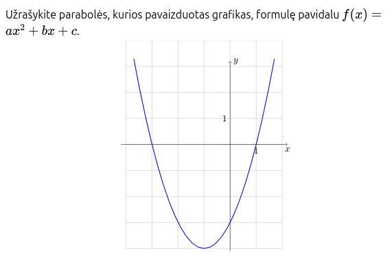

</summary>

````latex
Užrašykite parabolės, kurios pavaizduotas grafikas, formulę
pavidalu $f(x) = ax^2 + bx + c$.

```tikz
\begin{document}
  \begin{tikzpicture}

    % Draw grid
    \draw[step=1cm,very thin,color=black!50] (-4,-4) grid (2,4);

    % Draw axes
    \draw[->] (-4.2,0) -- (2.2,0) node[below] {$x$};
    \draw[->] (0,-4.1) -- (0,3.2) node[right] {$y$};

    % Draw absolute value function
    \draw[thick,blue,domain=-3.7:1.7] plot (\x,{pow(\x, 2) + 2 * \x - 3});

    % Labels for specific points
    \node[below] at (1,0) {1};
	\node[left] at (0,1) {1};

  \end{tikzpicture}
\end{document}
```
````
</details>

# Generic tikz examples

[Official tikz examples](https://github.com/artisticat1/obsidian-tikzjax?tab=readme-ov-file#examples)

<details>
<summary>

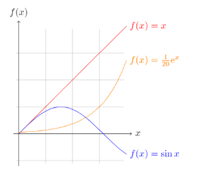

</summary>

````latex
```tikz
\begin{document}
  \begin{tikzpicture}[domain=0:4]
    \draw[very thin,color=gray] (-0.1,-1.1) grid (3.9,3.9);
    \draw[->] (-0.2,0) -- (4.2,0) node[right] {$x$};
    \draw[->] (0,-1.2) -- (0,4.2) node[above] {$f(x)$};
    \draw[color=red]    plot (\x,\x)             node[right] {$f(x) =x$};
    \draw[color=blue]   plot (\x,{sin(\x r)})    node[right] {$f(x) = \sin x$};
    \draw[color=orange] plot (\x,{0.05*exp(\x)}) node[right] {$f(x) = \frac{1}{20} \mathrm e^x$};
  \end{tikzpicture}
\end{document}
```
````

</details>

<details>
<summary>

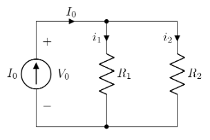

</summary>

````latex
```tikz
\usepackage{circuitikz}
\begin{document}

\begin{circuitikz}[american, voltage shift=0.5]
\draw (0,0)
to[isource, l=$I_0$, v=$V_0$] (0,3)
to[short, -*, i=$I_0$] (2,3)
to[R=$R_1$, i>_=$i_1$] (2,0) -- (0,0);
\draw (2,3) -- (4,3)
to[R=$R_2$, i>_=$i_2$]
(4,0) to[short, -*] (2,0);
\end{circuitikz}

\end{document}
```
````

</details>

<details>
<summary>

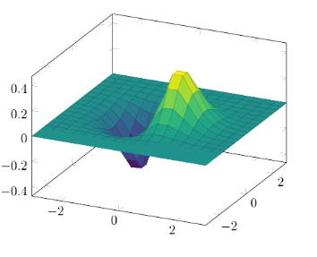

</summary>

````latex
```tikz
\usepackage{pgfplots}
\pgfplotsset{compat=1.16}

\begin{document}

\begin{tikzpicture}
\begin{axis}[colormap/viridis]
\addplot3[
	surf,
	samples=18,
	domain=-3:3
]
{exp(-x^2-y^2)*x};
\end{axis}
\end{tikzpicture}

\end{document}
```
````
</details>

<details>
<summary>

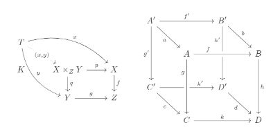

</summary>

````latex
```tikz
\usepackage{tikz-cd}

\begin{document}
\begin{tikzcd}

    T
    \arrow[drr, bend left, "x"]
    \arrow[ddr, bend right, "y"]
    \arrow[dr, dotted, "{(x,y)}" description] & & \\
    K & X \times_Z Y \arrow[r, "p"] \arrow[d, "q"]
    & X \arrow[d, "f"] \\
    & Y \arrow[r, "g"]
    & Z

\end{tikzcd}

\quad \quad

\begin{tikzcd}[row sep=2.5em]

A' \arrow[rr,"f'"] \arrow[dr,swap,"a"] \arrow[dd,swap,"g'"] &&
  B' \arrow[dd,swap,"h'" near start] \arrow[dr,"b"] \\
& A \arrow[rr,crossing over,"f" near start] &&
  B \arrow[dd,"h"] \\
C' \arrow[rr,"k'" near end] \arrow[dr,swap,"c"] && D' \arrow[dr,swap,"d"] \\
& C \arrow[rr,"k"] \arrow[uu,<-,crossing over,"g" near end]&& D

\end{tikzcd}

\end{document}
```
````
</details>

<details>
<summary>

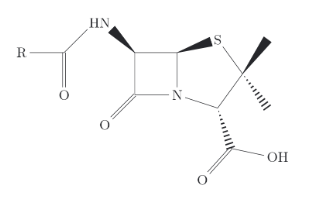

</summary>

````latex
```tikz
\usepackage{chemfig}
\begin{document}

\chemfig{[:-90]HN(-[::-45](-[::-45]R)=[::+45]O)>[::+45]*4(-(=O)-N*5(-(<:(=[::-60]O)-[::+60]OH)-(<[::+0])(<:[::-108])-S>)--)}

\end{document}
```
````

</details>

<details>
<summary>


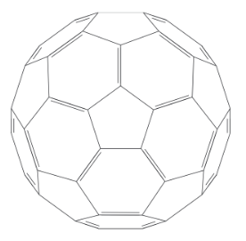
</summary>

````latex
```tikz
\usepackage{chemfig}
\begin{document}

\definesubmol\fragment1{

    (-[:#1,0.85,,,draw=none]
    -[::126]-[::-54](=_#(2pt,2pt)[::180])
    -[::-70](-[::-56.2,1.07]=^#(2pt,2pt)[::180,1.07])
    -[::110,0.6](-[::-148,0.60](=^[::180,0.35])-[::-18,1.1])
    -[::50,1.1](-[::18,0.60]=_[::180,0.35])
    -[::50,0.6]
    -[::110])
    }

\chemfig{
!\fragment{18}
!\fragment{90}
!\fragment{162}
!\fragment{234}
!\fragment{306}
}

\end{document}
```
````
</details>

# Where to generate tikz?

## Geogebra (PC app)

File > Export > Graphics View as PGF/Tikz > Generate PGF/Tikz code > Copy everything except the first `\documentclass` line

## Mathcha

*Tutorial coming soon...*
