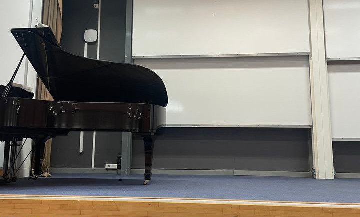

# Le petit concert de piano. Naglis & Paul

C'est le premier concert de Naglis & Paul à Évry.

### Quand?

Le 17 octobre 18:00-20:00

### Où?

Amphi10, Télécom SudParis, Évry, IDF

### Quoi?

Un petit concert de piano, environ 6 pièces. Gratuit, sûrement, mais, malhereusement, seulement pour les étudients de TSP-IMTBS...

Naglis:

1. J. Sibelius - 13 Pieces, Op. 76: No. 2 Etude
2. E. Satie - Gymnopédie No. 1
3. A. Tyliūnas - Noname No. 7 (https://youtu.be/0Nwi_o2NJ1g)

Paul:

1.
2. E. Satie - Gnossienne No. 1
3. F. Liszt - Liebesträume No. 3

Inscription: https://forms.gle/wjBVhK2PBaPJtum4A

Facebook événement: https://fb.me/e/1KdeJHEFQ
