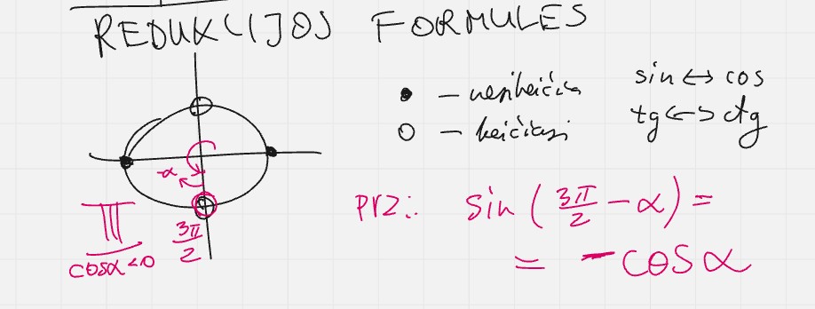

# Matematikos VBE uždavinių šablonai

## Trigonometrija

### Basics

1. $\sin^2\alpha + \cos^2\alpha = 1$ tipinis uždavinys

Rasti $\cos\alpha$, $\tg\alpha$, žinant, kad $\sin\alpha = \frac35$ ir $\frac\pi2 < \alpha < \pi$.

_Sprendimas_:

$\cos\alpha = \pm\sqrt{1-\sin^2\alpha}=-\sqrt{1-\left(\frac35\right)^2} = -\frac35$,

$+$ netinka, nes $\cos\alpha < 0 $, kai $\alpha \in II$.

2. Redukcijos

