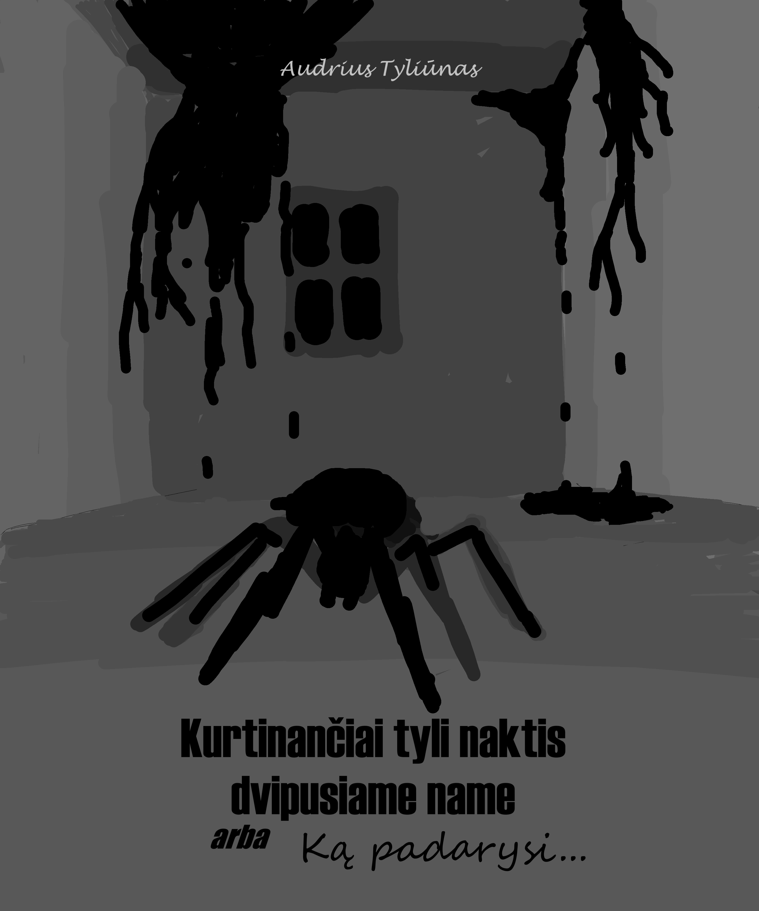

# Kurtinančiai tyli naktis arba Ką padarysi...

## About

A short horror story, written in the rest-from-writing-novel-snow time period. This is more like a draft version. But for now I'm not planning on editing it, preparing for pulishing or making other immprovements.

## Plot

Siūvykloje naujai įsidarbinęs jaunuolis pamato šiurpiają naktinę darbo vietos pusę

## Kur skaityti?

Va čia :D Full draft version:

PRIDETI ATSISIUSTI PDF

Arba čia, neturintiems laiko:

PRIDETI ATSISIUSTI PDF

Sypnosis/summary - SPOILER ALERT!

Here's short summary/sypnosis of the whole short story. For the lazy readers (or who doesn't have time to read 8.6k words) and for publishers.

Expand this to see summary. SPOILER ALERT!

Pagrindinis protagonistas - jaunuolis, naujas siūvyklos Veiksmas vyksta vėlyvą rudenį siūvykloje – sename name, sudarytame iš plataus priangio kambario, koridoriaus, vedančio iš šio prieangio, bei 4 nedidelių kambarių, su durimis koridoriuje. Koridoriaus gale yra durys į kitą namo dalį, kuri nepriklauso siūvyklai, o priklauso ten gyvenančiai močiutei. Namas turi palėpę. Pagrindinis protagonistas – jaunuolis, naujas siūvyklos darbuotojas.

### Pirmas

Viename iš siūvyklos kambarių, maždaug 16:50 protagonistas užsiūvinėdamas juodoje medžiagoje esančias skyles klausosi radijo. Čia prieangyje atėjęs siūvyklos savininkas/viršininkas Karolis sukelia šurmulį ir išpeikia atsakingą asmenį - Saulių - kad jis sukvietė dirbti žmonęs tą dieną, kai Karolis aiškiai sakė, kad niekas neturi būti šiame name. Visi siūvyklos darbuotojai iškart išėjo namo. Išskyrus Karolį, Saulių ir protagonistą, nes jam nebuvo niekas asmeniškai nepasakė grįžti namo (jis tik nugirdo pokalbį). Prieš einant namo Karolis liepė Sauliui susitvarkyti su protagonistu, kad jis dingtų iš šio namo iki sutemstant, o jei tiksliau - iki 17 valandos. Karolis perkabina užuolaidas – vietoje buvusių baltų, pakabina juodas.

Protagonistas dar norėjo užbaigti siūti vieną skylę juodoje medžiagoje, tačiau nerimo pilnas Saulius pareikalavo viską palikti kaip yra ir eiti namo. Dėl kilusių klausimų ir stabtelėjimų Saulius su protagonistu nespėja išeiti iš namo – Karolis pasako, kad jau yra per vėlu. Taip pat, pasirodo, name dar liko viena darbuotoja – Jolita. Ji irgi sėdėjo atskirame kambarėlyje ir užsiuvinėjo skyles juodose medžiagose. Skyrius baigiasi, kaip netyčia per daug pagarsinta radija pradeda groti išsiderinusią pianino muziką, ir Karolis tą radiją sudaužo. Nuo to laiko dingsta ir visas šurmulys, ir pasklinda tyla.

### Antras

Kilo nerimas ir įtampa, labiausiai nerimavo Saulius. Išeiti iš pastato nuo dabar Karolis jau griežtai visiem draudė, sakė, kad visi turės nakvoti čia. Toliau visa siūvykla yra ruošiama nakčiai – atidaromos visos durys, visur įjungiamos šviesos (išskyrus palėpėje) bei prisakoma jokiu būdu naktį jų neišjungti, priangyje paruošiamas baltas stalas su įvairiais keistais įrankiais ir stikliniu indeliu Jolitai (kartu su protagonistu, Sauliu ir Karoliu likusiai darbuotojai, nekalbiai moteriškėlei), kad ji galėtų gaminti kažkokius akmenukus. Taip pat ištraukiamos trys riestos medinės lazdos, su kažkokio mažo daikto laikikliu gale.

Saulius atvedė vos pajudančią, nė žodžio nepratarusią Jolitą iš jos kambario ir pasodino prie paruošto stalo. Taip pat Saulius atnešė didelį juodą šiukšlių maišą, prikimštą į baltą vatą panašios masės. Jolita ėmė tą vatą, visaip ją kočiojo, daužė, spaudė visokiais keistais įrankiais.

Iš koridoriaus vienos durys vedė į kambariuką su laiptais į palėpę, kitos durys į vonios kambarį, trečios ir ketvirtos vedė į atskirus darbo kambarius (vienas iš jų buvo protagonisto, kitas – Jolitos), tačiau dar buvo ir kitos durys koridoriaus gale – medinės, raštuotos. Jos vienintelės buvo uždarytos. Karolis pasakė, kad už jų nuo seno gyvena „daug labiau patyrusi už jį“ senutė, ir kad ji pati su viskuo susitvarkys. Tuomet Karolis parodė, kur gali protagonistas nusiprausti, išsivalyti dantis ir pasiruošti miegui. Tą protagonistas ir padarė, kol Karolis jam paruošė čiužinį miegojimui.

Besivalydamas dantis protagnistas rado kruviną skudurą viename bliūde. Protagonistas nesiėmė jokių papildomų veiksmų, tiesiog įtarė Karolį padarius kažką blogo. Karolis parodė protagonisto darbo kambaryje padėtą čiužinį, bei padavė juodą medžiagą (kuri protagonisto buvo iki galo nesutvarkyta) užsiklojimui, duris paliko praviras. Prieš užmiegant, protagonistas iš sklidusių garsų suprato, kad visi kiti žmonės priangyje gėrė arbatą, bei čia prie jų prisijungė ir toji senutė, atėjusi iš savo namo pusės.

### Trečias

Prieangy kilo šurmulys ir protagonistas prabudo. Netrukus spragtelėjo jungiklis ir šviesa kambaryje užgeso. Prieš užsitrenkiant durims, dėl iš koridoriaus einančios šviesos, protagonistas sugebėjo pamatyti aukštyn galva ant lubų kabančią juodą ir labai ilgą figūrą su dar ilgesnėmis rankomis, ilgais aštriais blizgančiais metaliniais nagais. Protagonistas tūnojo pasislėpęs po juodu užtiesalu. Pasigirdus nepanašiam į normalų garsą džeržgesiui visi kiti garsai koridoriuje nutilo. Protagonistas bandė rėkti, tačiau niekas neatėjo padėti. Metaliniai nagai paraišė užtiesimą ir pasinaudoję jame esančia neužsiūta skyle, stipriai sužeidė protagonisto pilvą.

Netrukus pasirodė Karolis, apsisiautęs juodu užtiesalu, pravėrė duris ir įjungė šviesą. Nutilo džeržgimas, vėl pasigirdo koridoriaus šurmulys. Kraujas susigėrė į pabaisos nagus, vienas lašelis, pakibęs ore, užskrido ant lubų ir į jas susigėrė. Ant lubų kabėjusi pabaisa sulindo į skaidriai žalią akmenuką Karolio laikomos medinės riestos lazdos gale. Akmenukas nusidažė juodai, protagonistas nepastebėjo, kur Karolis nunešė tą juodą akmenuką. Tarpdury pasirodė Saulius, netrukus pasirodė ir toji senutė – buvo labai maloni, jos vardas Danutė. Senutė sutvarkė žaizdą ir užklijavo pleistrus.

Tuomet kilo diskusija, kas užgesino šviesą, bet joks sprendimas nebuvo priimtas. Paaiškėjo, kad protagonisto šaukimo niekas negirdėjo. Karolis net ir po tokių įvykių neleido protagonistui išeiti iš namo ir grįžti namo. Jis paaiškino, kad ši naktis yra ypatinga – ji nutinka kartą per mėnesį. Tokios nakties metu keičiasi aplink erdvė – namas sujungia įvairias realybės atmainas, ir tokiu metu išėjus į lauką galima amžinai įstrigti kitoje realybėje. Taip pat Karolis pridūria, kad jis irgi kartą vos nemirė nuo pabaisų – jam paliko randą ant kaktos. Danutė leido protagonistui nusiimti pleistrus nuo pilvo. Žaizda jau buvo užgijusi.

### Ketvirtas

Galiausiai visi sėdėjo prieangyje ant čiužinių, užsikloję juodais užtiesimais ir gėrė arbatą. Jolita vienintelė darbavosi prie stalo. Iš baltos vatos ji gamino sodriai žalius akmenukus. Jos vyriški raumenys buvo įsitempę. Atrodė, tarsi ji kažką slėptų sau ant kelių po megztiniu. Karolis papasakojo protagonistui visą istoriją. Pradėjo nuo to, kaip jis prieš metus atidarė siūvyklą, ir šitas namas turėjo labai pigią kainą. Paskutiniai savininkai vieną naktį mįslingai dingo. Įsikūrus Danutė parodė juodąsias pabaisas. Pabaisos, kita vertus, pasirodo tik vieną kartą per mėnesį ir tik naktį. Tačiau reikia vis tiek budėti, kad nebūtų apgadintas turtas. Vėliau protagonistas nuėjo į tualetą. Išėjęs ioš vonios kambario jis rado sandėliuko kambarį tamsų, su prie laiptų gulinčiu Sauliaus kūnu. Čia pasirodęs Karolis su ironija pasakė „Na, mirė tai mirė, ką padarysi...“

### Penktas

Karolis pasakė protagonistui, kad čia Danutė padarė spąstus ir nužudė Saulių, ir nurodė grįžti į prieangį, kol jis užtemps lavoną į palėpę. Protagonistas, pasėdėjęs su savo apmąstymais negalėjo nuspręsti, kas yra žudikas, bet manė labiausiai tikėtina, kad pats Karolis. Grįžęs prie sandėliuko protagonistas pamatė, kaip Karolis užtempia lavoną į palėpę, tačiau čia esą kiti spąstai, dėl kurių yra sugadinama palėpės dangčio apsauga nuo pabaisų, ir čia iš palėpės atėjusi pabaisa, besivydama koridoriumi, pagauna Karolį. Jo kūnas užskrenda į lubas ir į jas susigeria. Iš palėpės veržiasi ir lipa lubomis daugiau pabaisų. Tuo tarpu protagonistas spėja pabėgti, ir su Danutės pagalba jis uždaro pabaisas sandeliuke, bei išjungia sandėliuko šviesą.

### Šeštas

Danutė nusivedė protagonistą į savo namo dalį. Ji pasakė, kad viską čia suplanavo Jolita. Danutės namo pusės patalpoje buvo truputį blankiau, čia lubomis ir sienomis ropojo begalė didelių vorų. Danutė nežino, kodėl Jolita nori visus nužudyti. Senutės nurodytas protagonistas pasislepia spintoje. Tuo tarpu pati senutė užsidėjo sprogmenų liemenę ir užlipusi į palėpę ją susprogdino.

Pro išsprogdintų lubų plyšius ir palėpės stogą matėsi šviesa, nors ir dar buvo naktis. Sienomis varvėjo į smalą panaši juoda masė.

### Septintas

Protagonistas nusprendžia nesislėpti ir kovoti. Tuomet su užsidegimu jis susiranda metalinį smaigalį ir išeina į koridorių. Tačiau čia jį už nugaros pasmeigia Jolita. Protagonistas iš karto nemiršta, sugeba dar sekti aplinką. Jolita, visa įtūžusi, nusitempia protagonistą į lauką. Ji turi pasiėmus tašelę, pilną prikrautą žalių akmenukų. Lauke vaizdas labai staigiai kito, keitėsi dangaus spalva, keitėsi metų laikas. Galiausiai protagonistą Jolita tempė ant nematomo paviršiaus ore, eidama aplink namą. Nuėjus į kitą namo pusę, namas buvo apverstas, visa palėpė atsistačius į pradinę padėtį, prieš sprogimą. Jolita įmetė protagonistą į palėpę ir užtrenkė palėpės duris. Čia protagonistas pamatė pravertą palėpės liuką (iš jo perspektyvos esantį viršuje) ir pabaisas (iš protagonisto perspektyvos esančias ant žemės). Galiausiai viena iš pabaisų susmeigia nagus protagonistui tiesiai į veidą, ir jis, žinoma, miršta.

